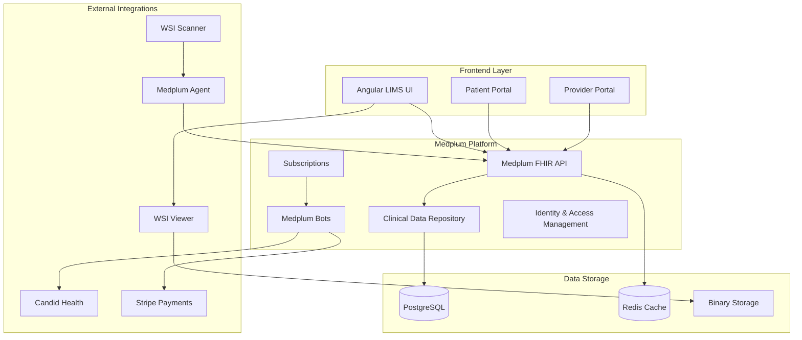

# Design Document

## Overview

This design document outlines the architecture for transforming the existing Angular-based LIMS application into a production-ready, FHIR-native system built on the Medplum platform. The design leverages Medplum's comprehensive healthcare backend to create a scalable, compliant, and interoperable laboratory information management system.

The system will replace the current mock services with real Medplum integration, implement advanced workflows for histopathology and microbiology, add comprehensive role-based access control, and integrate revenue cycle management capabilities.

## Architecture

### High-Level System Architecture



### Technology Stack

- **Frontend**: Angular 20 with TypeScript, SCSS, and Medplum React components (via Angular wrappers)
- **Backend**: Medplum Platform (Node.js, Express, PostgreSQL, Redis)
- **Authentication**: Medplum IAM with FHIR-based RBAC
- **Automation**: Medplum Bots (TypeScript in AWS Lambda)
- **Integration**: Medplum Agent for local device connectivity
- **Billing**: Candid Health for claims processing
- **Payments**: Stripe for patient payments
- **Imaging**: OpenSeadragon or Slim for WSI viewing

## Components and Interfaces

### Core Service Layer

#### MedplumService Enhancement
The existing mock MedplumService will be replaced with a real Medplum client integration:

```typescript
@Injectable({
  providedIn: 'root'
})
export class MedplumService {
  private medplum: MedplumClient;
  
  constructor() {
    this.medplum = new MedplumClient({
      baseUrl: environment.medplumBaseUrl,
      clientId: environment.medplumClientId,
      // Additional configuration
    });
  }
  
  // FHIR resource operations
  async createResource<T extends Resource>(resource: T): Promise<T>
  async readResource<T extends Resource>(resourceType: string, id: string): Promise<T>
  async updateResource<T extends Resource>(resource: T): Promise<T>
  async searchResources<T extends Resource>(resourceType: string, params: SearchParams): Promise<Bundle<T>>
  
  // Authentication methods
  async signIn(email: string, password: string): Promise<LoginAuthenticationResponse>
  async signOut(): Promise<void>
  getCurrentUser(): ProfileResource | undefined
  
  // Subscription management
  async createSubscription(criteria: string, endpoint: string): Promise<Subscription>
}
```

#### Authentication Service
```typescript
@Injectable({
  providedIn: 'root'
})
export class AuthService {
  private currentUser$ = new BehaviorSubject<ProfileResource | null>(null);
  private permissions$ = new BehaviorSubject<AccessPolicy[]>([]);
  
  async login(credentials: LoginCredentials): Promise<boolean>
  async logout(): Promise<void>
  getCurrentUser(): Observable<ProfileResource | null>
  getPermissions(): Observable<AccessPolicy[]>
  hasPermission(resource: string, action: string): boolean
}
```

### Enhanced UI Components

#### Role-Based Dashboard Component
```typescript
@Component({
  selector: 'app-dashboard',
  template: `
    <div class="dashboard-container">
      <div class="dashboard-header">
        <h1>{{ getDashboardTitle() }}</h1>
        <div class="user-info">{{ currentUser?.name }}</div>
      </div>
      
      <div class="dashboard-grid" [ngClass]="getUserRoleClass()">
        <div *ngFor="let widget of getWidgetsForRole()" class="dashboard-widget">
          <ng-container [ngSwitch]="widget.type">
            <app-specimen-queue *ngSwitchCase="'specimen-queue'" [config]="widget.config"></app-specimen-queue>
            <app-pending-reports *ngSwitchCase="'pending-reports'" [config]="widget.config"></app-pending-reports>
            <app-billing-summary *ngSwitchCase="'billing-summary'" [config]="widget.config"></app-billing-summary>
            <app-analytics-chart *ngSwitchCase="'analytics'" [config]="widget.config"></app-analytics-chart>
          </ng-container>
        </div>
      </div>
    </div>
  `
})
export class DashboardComponent {
  currentUser: ProfileResource | null = null;
  userRole: UserRole;
  
  getWidgetsForRole(): DashboardWidget[] {
    // Return role-specific widgets based on user permissions
  }
}
```

#### QR Code Integration Component
```typescript
@Component({
  selector: 'app-qr-code-generator',
  template: `
    <div class="qr-code-container">
      <qr-code 
        [value]="qrValue" 
        [size]="qrSize"
        [errorCorrectionLevel]="'M'"
        [bgColor]="'#ffffff'"
        [fgColor]="'#000000'">
      </qr-code>
      <div class="specimen-info">
        <div class="accession-id">{{ specimenId }}</div>
        <div class="patient-name">{{ patientName }}</div>
        <div class="collection-date">{{ collectionDate | date }}</div>
      </div>
      <button (click)="printLabel()" class="print-button">Print Label</button>
    </div>
  `
})
export class QrCodeGeneratorComponent {
  @Input() specimenId: string;
  @Input() patientName: string;
  @Input() collectionDate: Date;
  
  get qrValue(): string {
    return `${environment.baseUrl}/specimen/${this.specimenId}`;
  }
  
  printLabel(): void {
    // Implement label printing logic
  }
}
```

### Workflow Automation Components

#### Bot Service for Workflow Automation
```typescript
@Injectable({
  providedIn: 'root'
})
export class BotService {
  constructor(private medplum: MedplumService) {}
  
  // Patient registration bot
  async triggerPatientRegistrationBot(questionnaireResponse: QuestionnaireResponse): Promise<void> {
    await this.medplum.createResource({
      resourceType: 'Task',
      status: 'requested',
      intent: 'order',
      code: {
        coding: [{
          system: 'http://lims.local/bots',
          code: 'patient-registration'
        }]
      },
      input: [{
        type: { text: 'QuestionnaireResponse' },
        valueReference: { reference: `QuestionnaireResponse/${questionnaireResponse.id}` }
      }]
    });
  }
  
  // Order splitting bot
  async triggerOrderSplittingBot(serviceRequest: ServiceRequest): Promise<void> {
    // Implementation for order splitting automation
  }
  
  // Billing bot
  async triggerBillingBot(diagnosticReport: DiagnosticReport): Promise<void> {
    // Implementation for automated billing
  }
}
```

### Specialized Workflow Components

#### Histopathology Workflow Component
```typescript
@Component({
  selector: 'app-histopathology-workflow',
  template: `
    <div class="histopath-workflow">
      <div class="workflow-steps">
        <div *ngFor="let step of workflowSteps" 
             class="workflow-step" 
             [class.active]="step.id === currentStep"
             [class.completed]="step.completed">
          <div class="step-header">
            <h3>{{ step.name }}</h3>
            <span class="step-status">{{ step.status }}</span>
          </div>
          <div class="step-content" *ngIf="step.id === currentStep">
            <ng-container [ngSwitch]="step.id">
              <app-gross-examination *ngSwitchCase="'gross-exam'" [specimen]="currentSpecimen"></app-gross-examination>
              <app-tissue-processing *ngSwitchCase="'processing'" [specimen]="currentSpecimen"></app-tissue-processing>
              <app-embedding *ngSwitchCase="'embedding'" [specimen]="currentSpecimen"></app-embedding>
              <app-sectioning *ngSwitchCase="'sectioning'" [specimen]="currentSpecimen"></app-sectioning>
              <app-staining *ngSwitchCase="'staining'" [specimen]="currentSpecimen"></app-staining>
              <app-wsi-scanning *ngSwitchCase="'scanning'" [specimen]="currentSpecimen"></app-wsi-scanning>
              <app-pathologist-review *ngSwitchCase="'review'" [specimen]="currentSpecimen"></app-pathologist-review>
            </ng-container>
          </div>
        </div>
      </div>
    </div>
  `
})
export class HistopathologyWorkflowComponent {
  currentSpecimen: Specimen;
  workflowSteps: WorkflowStep[];
  currentStep: string;
  
  async completeStep(stepId: string, observations: Observation[]): Promise<void> {
    // Create FHIR Procedure resource for completed step
    // Update specimen status
    // Trigger next step in workflow
  }
}
```

#### WSI Integration Component
```typescript
@Component({
  selector: 'app-wsi-viewer',
  template: `
    <div class="wsi-viewer-container">
      <div class="viewer-toolbar">
        <button (click)="zoomIn()">Zoom In</button>
        <button (click)="zoomOut()">Zoom Out</button>
        <button (click)="resetView()">Reset</button>
        <button (click)="toggleAnnotations()">Annotations</button>
      </div>
      <div #viewerContainer class="viewer-content"></div>
      <div class="viewer-info">
        <div>Specimen: {{ specimen?.accessionIdentifier }}</div>
        <div>Magnification: {{ currentMagnification }}x</div>
        <div>Stain: {{ stainType }}</div>
      </div>
    </div>
  `
})
export class WsiViewerComponent implements OnInit, OnDestroy {
  @ViewChild('viewerContainer', { static: true }) viewerContainer: ElementRef;
  
  private viewer: any; // OpenSeadragon viewer instance
  specimen: Specimen;
  imagingStudy: ImagingStudy;
  currentMagnification: number;
  
  async ngOnInit(): Promise<void> {
    await this.initializeViewer();
    await this.loadImage();
  }
  
  private async initializeViewer(): Promise<void> {
    // Initialize OpenSeadragon viewer
  }
  
  private async loadImage(): Promise<void> {
    // Load WSI image from Medplum Binary resource
  }
}
```

## Data Models

### Enhanced FHIR Resource Models

#### Extended Patient Resource
```typescript
interface ExtendedPatient extends Patient {
  // Standard FHIR Patient fields plus:
  extension?: Extension[]; // For custom lab-specific data
  contact?: PatientContact[]; // Emergency contacts
  communication?: PatientCommunication[]; // Language preferences
}
```

#### Laboratory Specimen Resource
```typescript
interface LaboratorySpecimen extends Specimen {
  accessionIdentifier: Identifier; // Lab-assigned unique ID
  collection: SpecimenCollection & {
    collectedDateTime: string; // Required for lab workflow
    method: CodeableConcept; // Collection method (venipuncture, biopsy, etc.)
    bodySite?: CodeableConcept; // Anatomical location
    quantity?: Quantity; // Volume/amount collected
  };
  processing?: SpecimenProcessing[]; // Processing steps
  container?: SpecimenContainer[]; // Container information
  condition?: CodeableConcept[]; // Specimen condition
}
```

#### Histopathology Procedure Resource
```typescript
interface HistopathologyProcedure extends Procedure {
  code: CodeableConcept; // SNOMED CT procedure code
  subject: Reference; // Patient reference
  basedOn?: Reference[]; // ServiceRequest reference
  partOf?: Reference; // Parent procedure reference
  status: ProcedureStatus;
  performedDateTime?: string;
  performer?: ProcedurePerformer[];
  bodySite?: CodeableConcept[]; // Anatomical location
  outcome?: CodeableConcept; // Procedure outcome
  report?: Reference[]; // DiagnosticReport references
  usedReference?: Reference[]; // Equipment/materials used
}
```

### Workflow State Models

#### Laboratory Workflow State
```typescript
interface LabWorkflowState {
  specimenId: string;
  currentStep: WorkflowStep;
  completedSteps: WorkflowStep[];
  pendingSteps: WorkflowStep[];
  assignedTechnician?: Reference;
  priority: 'routine' | 'urgent' | 'stat';
  estimatedCompletion?: Date;
  actualCompletion?: Date;
}

interface WorkflowStep {
  id: string;
  name: string;
  description: string;
  status: 'pending' | 'in-progress' | 'completed' | 'failed';
  requiredRole: string[];
  estimatedDuration: number; // minutes
  dependencies: string[]; // prerequisite step IDs
  procedures: Reference[]; // Associated FHIR Procedures
  observations: Reference[]; // Associated FHIR Observations
}
```

## Error Handling

### Comprehensive Error Management Strategy

#### Error Types and Handling
```typescript
enum LIMSErrorType {
  AUTHENTICATION_ERROR = 'AUTHENTICATION_ERROR',
  AUTHORIZATION_ERROR = 'AUTHORIZATION_ERROR',
  VALIDATION_ERROR = 'VALIDATION_ERROR',
  NETWORK_ERROR = 'NETWORK_ERROR',
  FHIR_ERROR = 'FHIR_ERROR',
  WORKFLOW_ERROR = 'WORKFLOW_ERROR',
  INTEGRATION_ERROR = 'INTEGRATION_ERROR'
}

interface LIMSError {
  type: LIMSErrorType;
  message: string;
  details?: any;
  timestamp: Date;
  userId?: string;
  resourceType?: string;
  resourceId?: string;
}

@Injectable({
  providedIn: 'root'
})
export class ErrorHandlingService {
  private errorLog$ = new BehaviorSubject<LIMSError[]>([]);
  
  handleError(error: LIMSError): void {
    // Log error
    console.error('LIMS Error:', error);
    
    // Store in error log
    const currentErrors = this.errorLog$.value;
    this.errorLog$.next([...currentErrors, error]);
    
    // Show user-friendly message
    this.showUserMessage(error);
    
    // Send to monitoring service if critical
    if (this.isCriticalError(error)) {
      this.sendToMonitoring(error);
    }
  }
  
  private showUserMessage(error: LIMSError): void {
    // Display appropriate user message based on error type
  }
}
```

#### Retry Logic for Network Operations
```typescript
@Injectable({
  providedIn: 'root'
})
export class RetryService {
  async executeWithRetry<T>(
    operation: () => Promise<T>,
    maxRetries: number = 3,
    backoffMs: number = 1000
  ): Promise<T> {
    let lastError: Error;
    
    for (let attempt = 0; attempt <= maxRetries; attempt++) {
      try {
        return await operation();
      } catch (error) {
        lastError = error as Error;
        
        if (attempt === maxRetries) {
          throw lastError;
        }
        
        // Exponential backoff
        await this.delay(backoffMs * Math.pow(2, attempt));
      }
    }
    
    throw lastError!;
  }
  
  private delay(ms: number): Promise<void> {
    return new Promise(resolve => setTimeout(resolve, ms));
  }
}
```

## Testing Strategy

### Unit Testing Approach
- **Service Layer**: Mock Medplum client for isolated testing
- **Component Layer**: Angular testing utilities with mock services
- **Bot Logic**: Isolated TypeScript function testing
- **Integration**: End-to-end testing with test Medplum instance

### Test Data Management
```typescript
export class TestDataFactory {
  static createMockPatient(): Patient {
    return {
      resourceType: 'Patient',
      id: 'test-patient-1',
      name: [{ given: ['Test'], family: 'Patient' }],
      birthDate: '1990-01-01',
      gender: 'unknown'
    };
  }
  
  static createMockSpecimen(): Specimen {
    return {
      resourceType: 'Specimen',
      id: 'test-specimen-1',
      accessionIdentifier: { value: 'SP20240101001' },
      status: 'available',
      type: {
        coding: [{
          system: 'http://snomed.info/sct',
          code: '119376003',
          display: 'Tissue specimen'
        }]
      },
      subject: { reference: 'Patient/test-patient-1' }
    };
  }
}
```

### Performance Testing
- **Load Testing**: Simulate concurrent users accessing the system
- **Stress Testing**: Test system limits with high specimen volumes
- **Integration Testing**: Test Medplum API response times
- **WSI Performance**: Test large image file handling and viewer performance

This design provides a comprehensive foundation for implementing the missing features while maintaining the existing Angular structure and enhancing it with full Medplum platform integration.